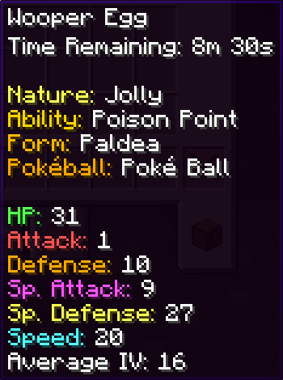
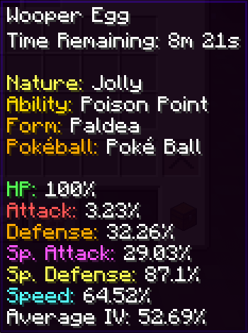
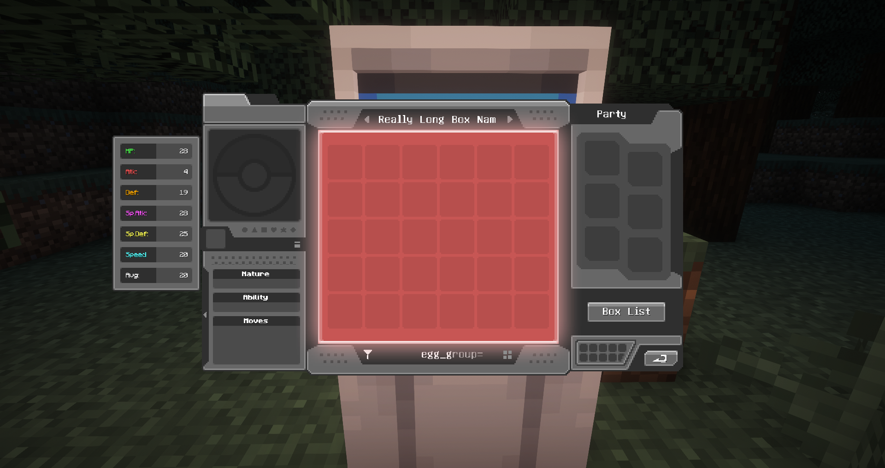
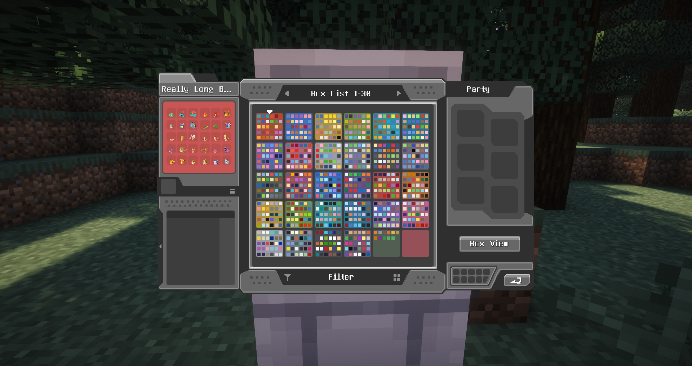
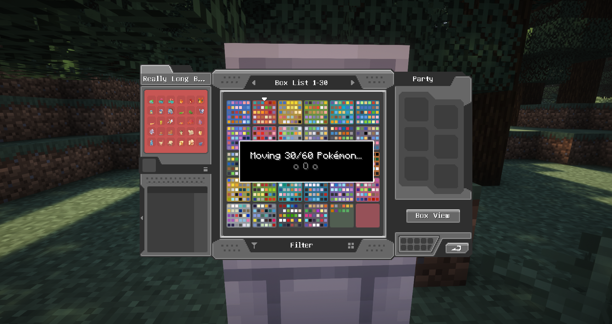
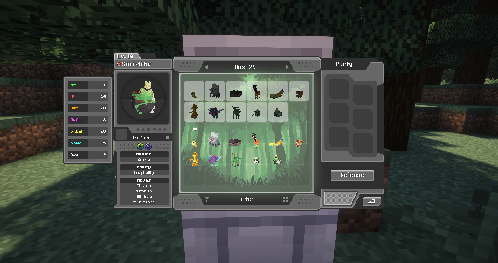
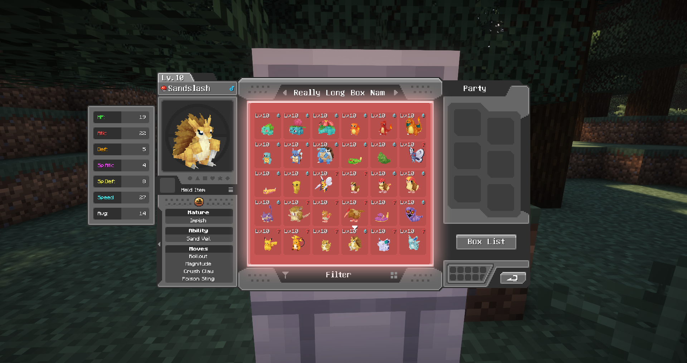
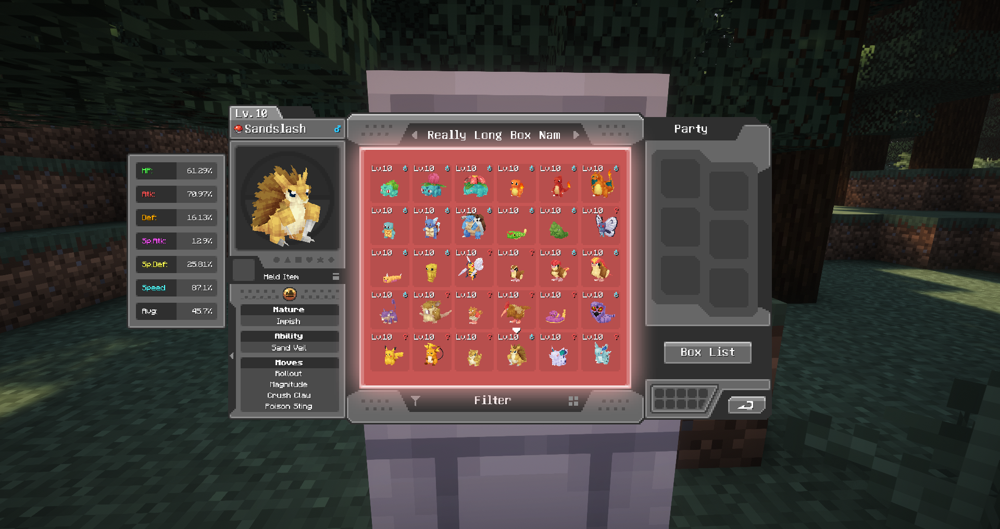

# MoreCobblemonTweaks
A qol cobblemon client mod introducing a variety of QOL features.
MoreCobblemonTweaks was the predecessor of the official PC search, box names, and box wallpapers system that was implemented in Cobblemon 1.7 primarily by yours truly!
They have since been removed from this mod, but there are still plenty of other features.

# Config
- All of the features listed in the section below can be individually tweaked in the mod's config. You can change them in the config file itself located in `configs/more_cobblemon_tweaks.json` or if mod menu & cloth config are installed, by using the in game editor (recommended).

# Supported Versions
Cobblemon: 1.6.1+ 
Cobbreeding: 1.8.8+ 
BetterBreeding: Most 

# Features
- Enhanced Item Lore
  - Enhanced Egg Lore (Supports: Cobbbreeding, and BetterBreeding)
    - Eggs will now show any stored data in the tooltip!
      - **KEEP IN MIND** some mods will allow servers to encrypt the data that's sent to the client, making it impossible for this mod to read the data when enabled.
      - In the case of cobbreeding for example, a tooltip will be shown warning you that the egg data is encrypted and cannot be displayed. (Disablable in config)
    - What data is showed is determined by what egg mod you are using & your servers config.
    - Below is a screenshot of an egg from Cobbreeding, which gives an example of what you can expect to see. (Name, form, ivs, etc)
    - Optionally (enabled by default) a shiny egg will have a gold star next to its name
    - Optionally (enabled by default) a perfect iv egg will have a aqua triangle next to its name
    - Optionally (enabled by default) a 0 iv egg will have a red hazard triangle next to its name
    - All of the above symbols can be replaced with text lines in the lore by a config option as well
    - 
    - 
- PC Enhancements
  - Increased Search/Filter Character Limit
    - You can type up to 100 characters instead of the normal 19. It will only show the characters around the cursor within the 19 character limit.
  - Search/Filter Autocomplete
    - When typing in the filter bar at the bottom of the screen you will now get autocomplete suggestions for search/filter terms!
    - You can also hit tab to fill the suggestion into the search bar.
    - 
  - Box Management
    - Adds box list/view button in the same place as the release button when the release button is not active.
    - Clicking it will open/close the box list view, where you can see all of your boxes in pages.
    - Left-clicking a box will select it, then left-clicking another box will swap the two boxes.
    - Right-clicking a box will open the box view for that box.
    - Using the wallpaper options in the box list view will change the wallpaper for all boxes on the current page.
    - You can also use the search/filter while in the box list view and will filter the boxes based on if any pokemon in the box match the filter.
    - 
    - 
  - Multiselect Move & Release
    - Adds a new button on the bottom right of the ui that will enable/disable multiselect mode.
    - While in the mode you can click individual slots to (de)select them, or shift+click to (de)select a range of slots.
    - While you have slots selected you can use the release button as normal to release all selected pokemon at once. Or you can move them around to other boxes as a group.
    - In the image below you can see an example of selecting three pokemon at once.
    - 
  - Iv Display
    - Adds an IV display to the left of the PC UI when opened, showing all of the iv's and the average iv of the previewed pokemon.
    - By default the iv's names are colored, but that can be disabled in the config.
    - You can hold shift to show the iv's as percentages instead of raw values.
    - 
    - 
- More coming soon! (Please feel free to make suggestions via Issues!)
